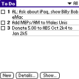

# Palm ToDo

A small CSS challenge for myself, recreating the ToDo List from my old Palm Zire.

Looked like this:

<figure>
	
	<figcaption>
		(Image from <a href="http://en.wikipedia.org/wiki/Palm_OS">Wikipedia</a>)
	</figcaption>
</figure>

